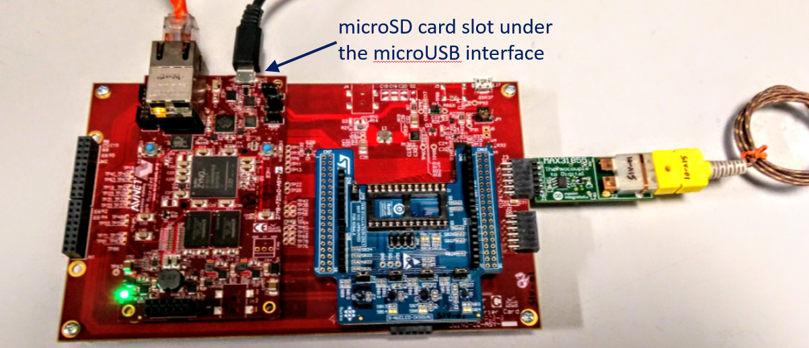

# Lab 1: Setup the Environment

In this lab, you will initialize your account with a static web application, Amazon Cognito, and other configuration.  You will also login to your Amazon Web Services account to configure credentials for the Xilinx hardware used in this workshop.

## Applying your Credits

If part of this workshop you received credits to offset any potential cost occurred in the AWS Cloud during this workshop, please follow these steps to apply the credits.


## Xilinx Hardware Setup

Most of the physical hardware will be pre-configured for you prior to the start of the workshop.  This section outlines the steps to configuring the physical aspects such that you can quickly check your hardware.

### Configuring and Deploying your Devices

Install the CP210x USB-to-UART driver used by both the MicroZed and Ultra96 boards.  If the driver is not automatically detected by your OS drivers can be downloaded from: https://www.silabs.com/products/development-tools/software/usb-to-uart-bridge-vcp-drivers

#### Avnet MicroZed IIoT Kit
1. Attach the ST Micro X-NUCLEO Shield to the Arduno Carrier Card.  This connects the sensor set to the FPGA programmable logic.
2. Plug in the Maxim 31855 PMOD thermocouple to Arduinio Carrier Card J3 connector labeld "PL_PMOD.  Match pin numbers (pin 1 to pin 1) between the boards - plugging into the top row of J3.  This connects the sensor to the FPGA programmable logic.
3. Plug the MicroZed System on Module (SoM) onto the Arduno Carrier Card.  When completed with this step the system should look like the picture below.

4. Ensure that the microSD card is plugged in. It is located on the bottom side of the board below the USB UART.  Check that the boot mode jumpers (JP1-JP3) are configured for SD Card boot (JP1 - Pins 1 & 2, JP2 - Pins 2 & 3, JP3 - Pins 2 & 3). See picture below for the proper jumper settings.

5. Plug an Ethernet cable from the RJ45 connector of the MicroZed SoM to the Ethernet switch on your table.
6. Connect one microUSB cable to J7 of the Arduino Carrier Card and the USB hub.  This provides power to the boards.
7. Connect one micorUSB cable to J2 of the MicroZed SoM and the USB hub.  This provides the debug UART interface. Set COM poart parameters to 115200,n,8,1.
 
#### Avnet Ultra96

1. Ensure that the microSD is plugged in.
2. Plug in the 12V power supply to J5.
3. Plug in the USB-to-Ethernet adapter to J9, then plug an Ethernet cable between the adapter and the Ethernet switch on your table.
4. Connect one micorUSB cable to J1 of the Ultra96 and the USB hub.  This provides the debug UART interface. Set COM port parameters to 115200,n,8,1.
5. Press the power button SW3 on the Ultra96 board to power it up.  S3 is the pushbutton switch near the power connector.

After the set-up the Ultra96 should look like the picture below.


### Testing your Devices

The MicroZed should power up automatically when you plug in the microUSB cable.  Ensure that D2 (blue LED) and D5 (green LED) on the MicroZed SoM are illuminated.
The Ultra96 should power up after pressing SW3.  You should see DS6 and DS9 (green LEDs) illuminated. 


## AWS Cloud Setup


### Prerequisites

These labs require that you have Git and the AWS Command Line Interface (CLI) installed in order to perform functions to the AWS Cloud.

### Clone Workshop Repository

In this section, you will clone the workshop Git repository.  The Git repository contains all the workshop code and scripts you will use.

1. If not already done, open the serial connection to the Ultra96 device as 115200-8-N-1.
2. Ensure you are in the $HOME directory

   ```bash
   cd $HOME
   ```
3. Clone the repository by running the following command, and set a shell variable for the directory to make navigation simpler.

   ```bash
   git clone https://github.com/rpcme/aws-cloud-and-xilinx-workshop
   export $WORKSHOP_HOME=$(pwd)/aws-cloud-and-xilinx-workshop
   cd $WORKSHOP_HOME
   ```
You're done! Let's move to the next section.

### Configure AWS Command Line Interface (CLI)

In this section, we will install and configure the AWS CLI.  The AWS CLI will be installed using the ```pip3``` utility.

1. Install the AWS CLI in the ```xilinx``` user ```$HOME``` directory.
2. Put the ```aws``` command line utility first in ```$PATH```.

   ```bash
   # Just in case the system gets rebooted
   echo 'export PATH=/home/xilinx/.something/path/here:$PATH' >> /home/xilinx/.profile
   
   # Set for the current shell
   export PATH=/home/xilinx/.something/path/here:$PATH
   ```
3. Configure the AWS CLI.  

### Deploy AWS Cloud Artifacts

In this section, you will deploy AWS Cloud artifacts to your AWS account by using AWS Cloudformation.

1. Navigate to the directory containing the scripts for deploying cloud objects.

   ```bash
   cd $WORKSHOP_HOME/cloud/script
   ```
2. Run the script that triggers the Cloudformation deployment.  The script packages deployable artifacts such as AWS Lambda functions, copies all the artifacts to an S3 bucket, and then executes the Cloudformation script from that S3 bucket.

	```bash
	./deploy-cloud-handlers.sh
	```

The Cloudformation deployment occurs asynchronously, so the script will immediately return with a resulting stack deployment ID. You can use this stack deployment id to check the status of the deployment. 

## Outcomes
In this lab, you installed prerequisites to your workstation and installed lab prerequisites to the AWS Cloud in your account.

# Learning More About These Concepts


[Next Lab](./Lab2.md)

[Index](./README.md)


