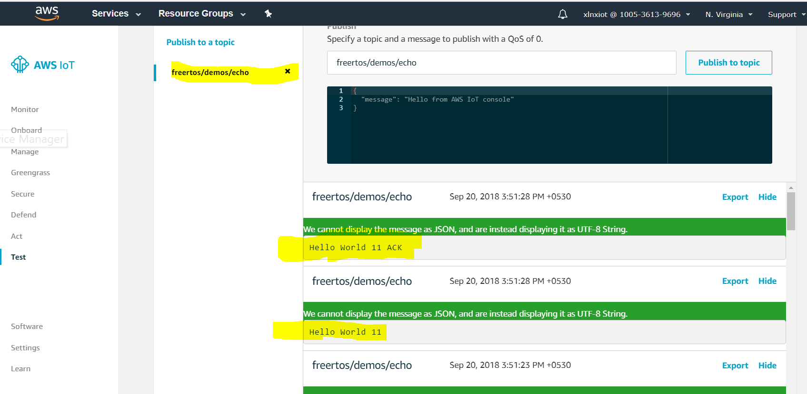

# Lab 2. Establish Amazon FreeRTOS and AWS Greengrass Connectivity

In this lab we will establish basic connectivity to the AWS cloud for both the MicroZed and Ultra96 devices.  In order to do this, we need to establish unique device identities that enable authentication to AWS IoT.  This is done through a client certificate and private key.  You will need to create these credentials in your AWS account and then configure them to each device.

## Configure and Deploy AWS IoT Credentials

In this section, you will configure and deploy AWS IoT Credentials.  The physical credential files, the private key and certificate for each device, will be placed in ```$WORKSHOP_HOME/edge/auth-node-zynq7k``` and ```$WORKSHOP_HOME/edge/auth-gateway-ultra96```.

1. Navigate to the directory containing the scripts for deploying cloud objects.

   ```bash
   cd $WORKSHOP_HOME/cloud/script
   ```
2. Run the script that configures the credentials for the devices to connect to your AWS account through AWS IoT.

	```bash
	./deploy-awsiot-objects.sh <your-group-prefix>
	```

   When the script completes, the keys and certificates will be in the directories specified above. 
   Note that your AWS Greengrass group prefix does not have to be the same as your unique prefix used in S3 deployment.

3. Using the RNDIS adapter of Ultra96, copy some files from the ```$WORKSHOP_HOME/edge/auth-node-zynq7k``` directory to your laptop. In a psftp session, you would:
    1. open xilinx@192.168.1.3  # Enter *xilinx* for password
    2. lcd c:\temp
    3. cd aws-cloud-and-xilinx-workshop/edge/auth-node-zynq7k
    4. get node-zynq7k.crt.pem
    5. get node-zynq7k.key.prv.pem
    5. quit

## Configure and Deploy AWS Greengrass on Xilinx Ultra96

The Ultra96 runs Linux and AWS Greengrass. Use the following steps to prepare the credentials for your Ultra96 board,
so that your Ultra96 can be used as a greengrass core.

1. Copy the private key and certificate to AWS Greengrass.

   ```bash
   sudo cp $WORKSHOP_HOME/edge/auth-*gateway-ultra96/*pem /greengrass/certs/
   ```

2. Copy the AWS Greengrass configuration file ```config.json``` to the AWS Greengrass installation.

   ```bash
   sudo cp $WORKSHOP_HOME/edge/auth-*gateway-ultra96/config.json /greengrass/config/
   ```

3. With the certificates and configuration file in place,  we can start 
   the AWS Greengrass core service. Run the following commands in the 
   Ultra96 terminal window.

	```bash
	sudo /greengrass/ggc/core/greengrassd start
	```

4. Build and upload the AWS Lambda function named ```xilinx-hello-world```.

	```bash
	cd $WORKSHOP_HOME/cloud/script
	./make-and-deploy-lambda.sh xilinx-hello-world
	```

	You can see from its output that the script performs the following acts:

	- Creates a Role for the function if the Role does not already exist
	- Packages the code located in ```$WORKSHOP_HOME/cloud/xilinx-hello-world``` to a zip file
	- Uploads the code to the AWS Lambda service
	- Applies a version number to the function
	- Creates an alias for the function

5. Although in this lab we are only using one lambda function, let's repeat this step for all the lambda
   functions so that we do not need to re-create the AWS Greengrass group.
   
	```bash
	./make-and-deploy-lambda.sh xilinx-bitstream-deploy-handler
	./make-and-deploy-lambda.sh xilinx-image-upload-handler
	./make-and-deploy-lambda.sh xilinx-video-inference-handler
	```
   Again, these lambdas will be used in later labs.

6. Make the initial AWS Greengrass group configuration. The group creation 
   has been automated to reduce the amount of time required for this procedure.

	```bash
	cd $WORKSHOP_HOME/edge/script
	./greengrass-core-init.sh <your-s3-bucket-name> <your-group-prefix>
	```
   Based on the previous lab, your s3 bucket name should have a format of `<your-unique-prefix>-aws-cloud-and-xilinx-workshop`.

7. Perform the initial deployment of AWS Greengrass.

	Run these commands in the Ultra96 terminal window.

	```bash
	cd $WORKSHOP_HOME/cloud/script
	./deploy-greengrass-group.sh <your-group-prefix>
	```

8. Go to the AWS IoT Console page and click on "Test".  Click on "Subscribe to a topic" and enter "hello/world". You should now see a MQTT response from the Ultra96 platform in the test window response.  See picture below for expected response.


## Configure and Deploy Amazon FreeRTOS on Xilinx Zynq-7010

The MicroZed device runs Amazon FreeRTOS from a micro SD card. Your card contains a pre-built file 'BOOT.bin'. You need to add more files to this card to link your hardware to your IoT account.
will copy the credentials files ```$WORKSHOP_HOME/edge/auth-node-zynq7k/node-zynq7k.crt.pem``` and ```$WORKSHOP_HOME/edge/auth-node-zynq7k/node-zynq7k.key.prv.pem``` into directory.  These credentials will link the device to your account which we will then subscribe to a pre-defined MQTT message from the platform.

1. Power off the MiroZed board by unplugging the USB cables.
2. Eject the SD Card.
3. Move the SD card to your laptop. Note the drive letter.
3. Copy the following files from C:\temp to the SD card, and eject it cleanly.
    1. node-zynq7k.crt.pem
    2. node-zynq7k.key.prv.pem
    3. node-zynq7k.broker.txt
4. Plug the microSD card into the MicroZed board and power the system.
5. In the AWS IoT Console for your region, navigate to the **Test** tool listed in the left column.
6. Select "Publish to a topic" sub-menu and enter "freertos/demos/echo" and click the "Publish to topic". See picture below.

	
7. You should now see a MQTT response from the MicroZed platform in the test window response.  See picture below for expected response.

	

# Outcomes

In this lab we established basic "hello world" connectivity from an a:FreeRTOS IoT node on the MicroZed platform and from a Linux Greengrass IoT node on the Ultra96 platform.

# Learning More About These Concepts

[Next Lab](./Lab3.md)

[Index](./README.md)
