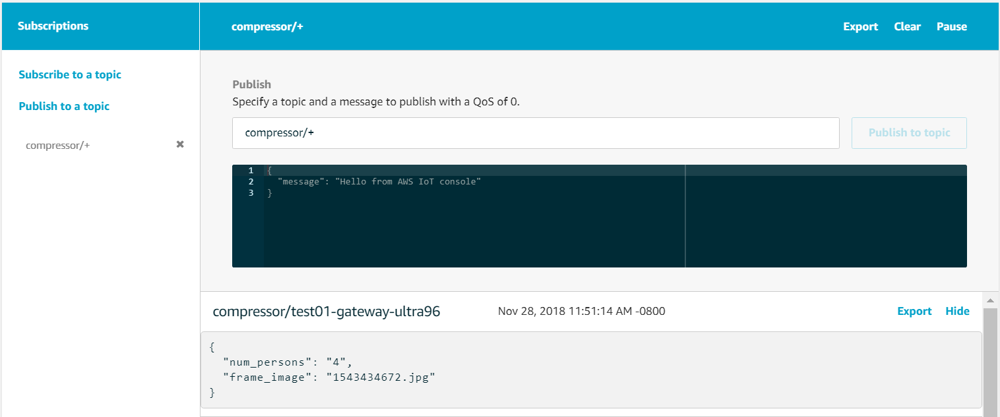

# Lab 5: Deploy ML in the edge

In this lab we will experience FPGA based machine learning (ML) video 
surveillance application to the remote asset unit controller for the **Compressor** physically represented by the Ultra96 development board.
The AWS IoT console will serves as the system deployment dashboard; we will incrementally add and test functions for the running system.

## Preparation

Before doing this lab, make sure lab 4 completes without any problem.

## Lab Steps

1. In AWS IoT Console go to the **Manage** menu on the left pane.
2. Click **Things**, which is the first item under **Manage**.
3. Locate the Thing that represents your core. The name is ```<prefix>-gateway-ultra96```.
4. Click on **Shadow**.
5. The first time you get onto this page, you may need to create a shadow document. Otherwise click on the **Edit** link. 
6. Change the Device Shadow JSON document until it aligns with the following block where the desired state for ```bitstream_version``` is ```2```.  Note, based on what has happened in previous labs, the Device  Shadow might look slightly different.  The key is setting the desired state of the ```bitstream_version```.

	```json
   	{
     	    "desired": {
       		"bitstream_version": 2
     	    }
   	}
	```

7. Click **Save**.

	For a moment, you will see a ```delta``` section.  And then it will disappear.  Also the ```reported``` section for the value displays ```2```.
    The result looks like the following:
	
    

    > **What just happened?**  When changing the desired state, the event triggered the AWS Lambda function in AWS Greengrass to download version 2.  When it completed, the AWS Lambda function reported back that it completed downloading version 2.

8. After this call, your `/home/xilinx/download` is no longer empty.
   This indicates the Ultra96 has received the ML configuration files 
   ('.bit' and '.txt') from the AWS cloud.
   
9. In the file `parameters.txt`, the first value is the parameter 
   'num_seconds', and the second value is the parameter 'threshold'. The threshold should now be '3', demonstrating a parameterized change in behavior.

    > **Wait, what about the bitstream?** Sure! If you have a newly developed bitstream, you can deliver it in the same way.

10. point the camera to a framed area of three persons or more.
You should see the "Person Detect Indicator" LED lit when a number of 
persons are in view of the camera. 

    

    Point the camera at a location where there are no persons; you should see 
    that LED turn off.

11. If there are people detected, you will see a number of files 
generated in `$HOME/<prefix>-aws-cloud-and-xilinx-workshop`. 
These files will be uploaded onto the S3 bucket. 
As shown in the last lab, you can see some messages 
if you subscribe to the topic `compressor/+`.

    

12. On the Ultra96 debug interface navigate to the directory that is 
synchronized with your S3 bucket.

    ```bash
    cd $HOME/<prefix>-aws-cloud-and-xilinx-workshop
    ```

    You will see several new files generated. The ```<epoch-time>.png``` files are the captured frames; the ```<epoch-time>.txt``` files store the number of people captured in that frame.

13. Go to your S3 bucket on AWS cloud; you will see there is a new folder `images` created. Check the images stored in that folder.


## Outcomes
In this lab we used AWS Greengrass to deploy an ML video 
surveillance application to a running control system in the Ultra96 platform. 


# Learning More About These Concepts


[Index](./README.md)

