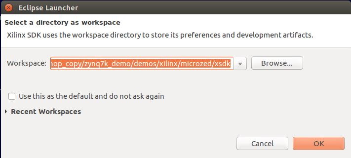
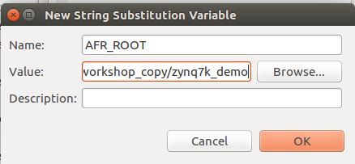
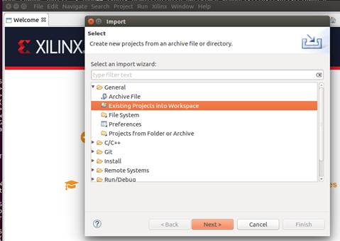
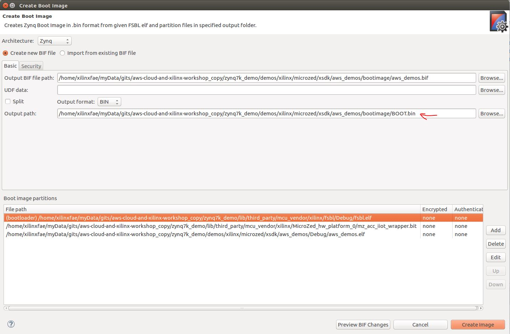

These are the steps to build the MicroZed code for the workshop:

1. Clone the workshop repo https://github.com/rpcme/aws-cloud-and-xilinx-workshop. Let’s call that ``CLONEPATH`` (e.g. ```/home/xilinxfae/myData/aws_cloud-and-xilinx-workshop_copy```).

2. Launch Xilinx SDK, and specify the workspace location as: ```CLONEPATH/zynq7k_demo/demos/xilinx/microzed/xsdk```.
   

3. When XSDK starts, a help tab covers most of the GUI. Close the help tab by clicking the **X**.

   

4. You will see an empty workspace. Disable ‘Project -> Build automatically’

   

5. Open ‘Window -> Preferences -> Run/Debug -> String Substitution’ and click New...

   

6. Create a new variable ```AFR_HOME``` and set its value to ```CLONEPATH/zynq7k_demo```
   YOU SHOULD USE ONLY FORWARD SLASHES '/' FOR THE PATH SEPARATOR, EVEN ON WINDOWS
   e.g. D:/b/reinvent/aws-cloud-and-xilinx-workshop-master/zynq7k_demo

   

7. OK your way back to the empty workspace

8. Import pre-defined projects into workspace – the root directory should be ```AFR_HOME```.

   File -> Import... -> General -> Existing Projects into Workspace -> Next -> Select Root Directory -> Browse...
   DOUBLE CHECK THE ROOT DIRECTORY AFTER SETTING IT AS IT MAY END UP SELECTING A SUBDIRECTORY. MANUALLY EDIT IF NECESSARY.
   Make sure to select all projects except 'aws_tests' which is not used in this workshop.
   
   

   

   

	Click Finish.

9. Enable ```Project -> Build automatically``` and everything will build, albeit with warnings. Click on the Console tab so you know when the build is done.

10. Highlight the project 'aws_demos' by left-clicking it once. Right click on it, and select 'Create Boot Image'

   

11. A menu will pop up, prefilled with files to include. Note the 'Output Path'. Click 'Create Image'.
   
   
   IMPORTANT: Click OK if the following popup message appears:
   

12. Copy BOOT.BIN from the Output path to your SD card.
