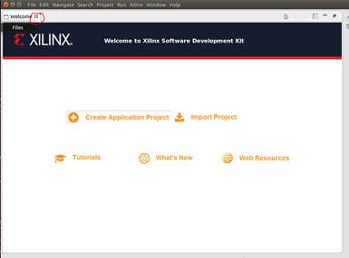
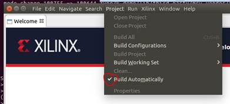
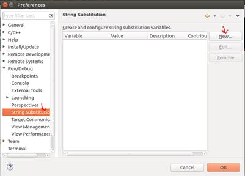
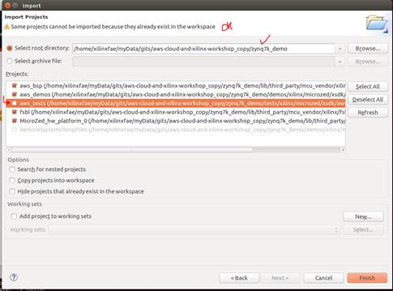

Clone it, let’s call that ``CLONEPATH`` (e.g. ```/home/xilinxfae/myData/aws_cloud-and-xilinx-workshop_copy```)
Open Xilinx SDK workspace at: ```CLONEPATH/zynq7k_demo/demos/xilinx/microzed/xsdk```

1. Close the help tab by clicking the **X**.

   

2. Disable ‘Project -> Build automatically’

   

3. Open ‘Window -> Preferences -> Run/Debug -> String Substitution’ and click New

   

4. Create a new variable ```AFR_HOME``` and set its value to ```CLONEPATH/zynq7k_demo```

   

5. OK your way back to the empty workspace
6. Import all projects as described in document – the root directory should be the same as the ```AFR_HOME``` directory.


   DOUBLE CHECK THIS AFTER SETTING IT AS IT SEEMS TO REFER TO A SUBDIRECTORY AFTER SETTING IT. MANUALLY EDIT IF NECESSARY.
   
   

   

   

	Click Finish.
	
7. Enable ```Project -> Build automatically``` and everything will build, albeit with warnings
8. Follow documented flow to create BOOT.BIN for MicroZed
